<h1 align="center">S. Lavi · <code>idl3o</code></h1>

  <em>🦁 idling</em> · os web dev · Kernow · UTC-12

  <code>value is not a quantity you measure but an agreement that holds</code>

  

  

  ⟶ <a href="https://github.com/idl3o/gallery">the gallery</a> — plates, hand-cut

