<h1 align="center">S. Lavi · <code>idl3o</code></h1>

  <em>🦁 idling</em> · os web dev · Kernow · UTC-12

  <code>value is not a quantity you measure but an agreement that holds</code>

  

  <a href="https://idl3o.github.io/derivation-of-value">D-of-V</a> · <a href="https://esoterica.vercel.app">esoterica</a> · <a href="https://github.com/idl3o/gallery">gallery</a>

